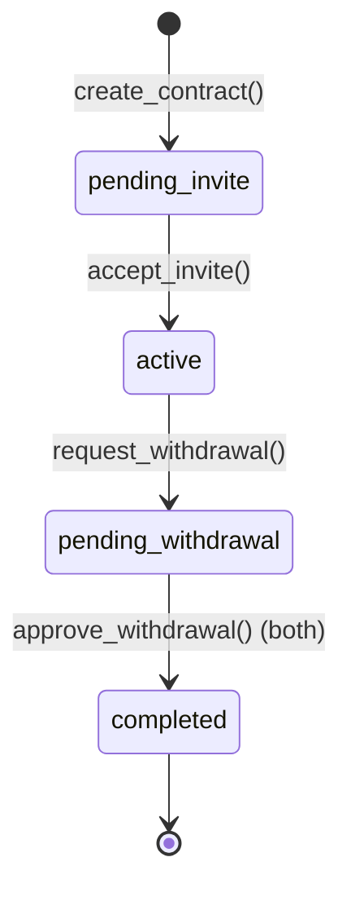

# 💍 FairSplit Protocol

> *A decentralized marriage asset management protocol on Algorand blockchain*

## 🌟 Overview

**FairSplit** is a transparent and fair asset management smart contract designed for couples who want to pool their financial resources while maintaining clear records of individual contributions. Built on the Algorand blockchain, it ensures immutability, transparency, and automated fair distribution.

### ✨ Key Features

- 🤝 **Couple Registration System** - Secure invitation and acceptance flow
- 💰 **Transparent Deposit Tracking** - Every contribution is recorded on-chain
- 📊 **Tiered Points System** - Fair reward mechanism based on deposit amounts
- ✅ **Mutual Approval Mechanism** - Both parties must agree to withdraw
- 🔄 **Automatic Distribution** - Smart contract handles fund distribution based on contribution ratio
- 🛡️ **Decentralized & Trustless** - No third-party control, only code execution

---

## 📋 How It Works

### 1️⃣ **Contract Creation**
- Spouse 1 creates the contract and becomes the primary account
- Contract is initialized with `pending_invite` status

### 2️⃣ **Invitation & Acceptance**
- Spouse 1 invites Spouse 2 by providing their Algorand address
- Spouse 2 accepts the invitation
- Contract status changes to `active`

### 3️⃣ **Deposits & Points**
- Both spouses can deposit ALGO into the shared pool
- Each deposit earns points based on the **Tiered Points System**
- Points determine the distribution ratio during withdrawal

### 4️⃣ **Withdrawal Process**
- Either spouse can request a withdrawal
- Both spouses must approve the withdrawal request
- Upon dual approval, funds are automatically distributed
- Either spouse can reject and return to `active` state

---

## 🎯 Tiered Points System

The contract uses a fair points system to reward contributions:

| Deposit Amount (ALGO) | Points Earned | Notes |
|------------------------|---------------|-------|
| **< 5 ALGO** | 0.5 points | Encourages small deposits |
| **5 - 9.99 ALGO** | 0.75 points | Mid-tier reward |
| **≥ 10 ALGO** | `floor(amount/20)` points | Scales with large deposits |

### 📌 Examples:
- Deposit **3 ALGO** → Earn **0.5 points**
- Deposit **7 ALGO** → Earn **0.75 points**
- Deposit **25 ALGO** → Earn **1 point** (25/20 = 1.25 → floor = 1)
- Deposit **100 ALGO** → Earn **5 points** (100/20 = 5)

---

## 💸 Platform Fee & Minimum Balance

### Platform Fee: **6.5%**
- Deducted from the distributable pool during withdrawal
- Sent to the platform address: `KO64H7YGWF6EEGP3EALQZTFR66UNYSRJLZOYGWGP5GTV2E4PBQDWFZNMIY`

### Minimum Balance: **0.1 ALGO**
- Reserved in the contract to maintain account status
- Not included in distribution calculations

---

## 🔐 Contract States



| State | Description |
|-------|-------------|
| `pending_invite` | Waiting for Spouse 2 to accept invitation |
| `active` | Both spouses joined, deposits allowed |
| `pending_withdrawal` | Withdrawal requested, awaiting approvals |
| `completed` | Funds distributed, contract lifecycle ended |

---

## 📖 Usage Guide

### Creating a Contract

```python
# Spouse 1 creates the contract
create_contract() 
# Returns: "Contract created. Wait for spouse invitation."
```

### Inviting a Spouse

```python
# Spouse 1 invites Spouse 2
invite_spouse(spouse_address="SPOUSE2_ALGORAND_ADDRESS")
# Returns: "Spouse invited. Waiting for acceptance."
```

### Accepting Invitation

```python
# Spouse 2 accepts the invitation
accept_invite()
# Returns: "Invitation accepted. Contract is now active."
```

### Making Deposits

```python
# Either spouse can deposit (must include payment transaction)
deposit(payment=PaymentTransaction)
# Returns: "Spouse X deposit success"
```

### Requesting Withdrawal

```python
# Either spouse can initiate withdrawal
request_withdrawal()
# Returns: "Withdrawal requested. Both spouses must approve."
```

### Approving Withdrawal

```python
# Both spouses must call this
approve_withdrawal()
# First approval: "Spouse X approved. Waiting for spouse Y."
# Second approval: "Both approved. Funds distributed."
```

### Checking Contract Info

```python
# Query current contract state
get_contract_info()
# Returns: (status, spouse_1, spouse_2, spouse_1_points, spouse_2_points, total_pool)
```

---

## 💡 Use Cases

### 📌 **Scenario 1: Shared Savings**
- **Couple A** wants to save for a house
- They both deposit monthly into FairSplit
- Each contribution is tracked transparently
- When goal is reached, they withdraw with fair distribution

### 📌 **Scenario 2: Joint Investment**
- **Partner 1** deposits 60 ALGO (3 points)
- **Partner 2** deposits 40 ALGO (2 points)
- Total pool: 100 ALGO
- Upon withdrawal:
  - Platform fee: 6.35 ALGO (6.5%)
  - Partner 1 receives: ~56.19 ALGO (60% of 93.65)
  - Partner 2 receives: ~37.46 ALGO (40% of 93.65)

### 📌 **Scenario 3: Emergency Exit**
- Either spouse can request withdrawal
- Both must approve (prevents unilateral decisions)
- If disagreement occurs, rejection returns to active state

---

## 🛠️ Technical Details

### Built With
- **Language**: AlgoPy (Python-based Algorand smart contract language)
- **Blockchain**: Algorand
- **Contract Type**: ARC4 Application

### Security Features
- ✅ Authorization checks (only spouses can perform actions)
- ✅ State validation (actions only allowed in correct states)
- ✅ Safe math operations (no overflow/underflow)
- ✅ Minimum balance protection
- ✅ Dual approval requirement for withdrawals

### Contract Storage
- Spouse addresses (2)
- Points tracking (2)
- Total pool amount
- Contract status
- Approval flags (2)
- Platform configuration

---

## 🚀 Deployment

### Prerequisites
- Algorand wallet with funded account
- AlgoPy development environment
- Algorand CLI tools

### Steps
1. Compile the contract:
   ```bash
   algokit compile py smart_contracts/fair_split/contract.py
   ```

2. Deploy to testnet/mainnet:
   ```bash
   algokit deploy
   ```

3. Note the Application ID for interactions

---

## 📊 Example Calculation

### Initial State
- Spouse 1 deposits: 10 ALGO → 0 points (10/20 = 0)
- Spouse 2 deposits: 30 ALGO → 1 point (30/20 = 1)
- Wait... Let me recalculate based on code

Actually:
- 10 ALGO → `floor(10/20) * 100 = 0 * 100 = 0` points? No wait...
- Looking at code: `(amount_algo // UInt64(20)) * UInt64(100)`
- 10 ALGO → (10 // 20) * 100 = 0 * 100 = 0 points
- 25 ALGO → (25 // 20) * 100 = 1 * 100 = 100 points (1 point)

Let me correct the example:

### Deposit History
- Spouse 1 deposits: 25 ALGO → Earns 1.00 points (25/20 = 1)
- Spouse 2 deposits: 75 ALGO → Earns 3.00 points (75/20 = 3)
- **Total Pool**: 100 ALGO
- **Total Points**: 4.00

### Withdrawal Distribution
1. **Minimum Balance Reserved**: 0.1 ALGO
2. **Distributable Pool**: 99.9 ALGO
3. **Platform Fee (6.5%)**: 6.49 ALGO
4. **After Fee**: 93.41 ALGO
5. **Spouse 1 Share (25%)**: 23.35 ALGO
6. **Spouse 2 Share (75%)**: 70.06 ALGO

---

## ⚠️ Important Notes

1. **Irreversible Distribution**: Once both spouses approve, distribution is automatic and cannot be reversed
2. **Minimum Balance**: 0.1 ALGO always remains in contract
3. **Platform Fee**: 6.5% is deducted from every withdrawal
4. **Points Are Permanent**: Points cannot be reduced or transferred
5. **One-Time Use**: After completion, contract cannot be reactivated

---

<div align="center">

**Built with ❤️ on Algorand Blockchain**

*Fair, Transparent, Decentralized*

</div>
